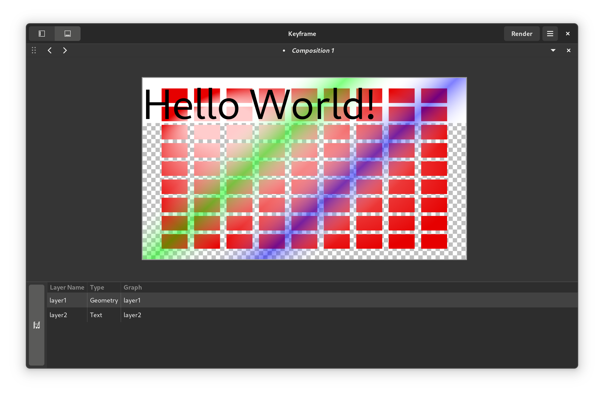

# Keyframe
A motion graphics editor for GNOME.

Keyframe has a particular emphasis on text (video titles).

There's nothing to see here at the moment.

## Building
It is strongly recommend to build with flatpak as Keyframe depends on
some unreleased libraries. Namely:
 
 - GTK 4 (v4.3)
 - [libpanel](https://gitlab.gnome.org/chergert/libpanel)

You will need GNOME's nightly flatpak runtime and SDK to build. This
can be obtained by installing the gnome-nightly repository. See
[this page](https://wiki.gnome.org/Apps/Nightly) for more information.

For dev/building/testing, open this project in GNOME Builder. It will
automatically obtain the relevant dependencies for you and build the
result in a container.
